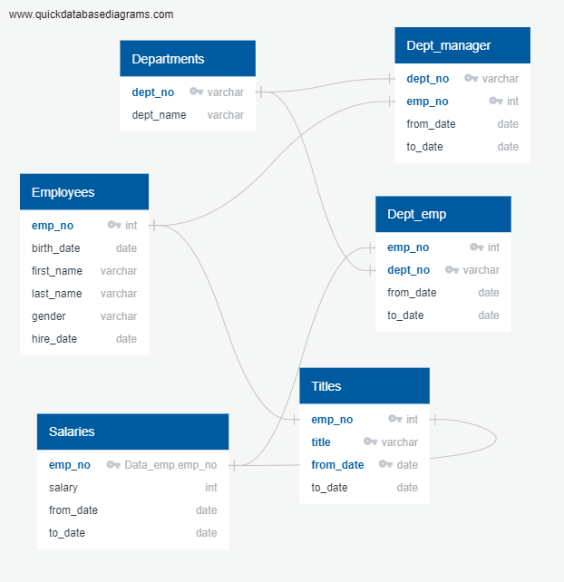

# Pewlett-Hackard-Analysis
## Overview of the analysis:
### Explain the purpose of this analysis.
For this anaylsis, we had to consider the amount of people that are about to retire from Hewlett Hackard per title. Once we had this information, we had to see how many people were eligible for the mentorship program. The datasets we used for this anaylsis are here: 

## Results: 
### Provide a bulleted list with four major points from the two analysis deliverables.
The main insights from the analysis are:
* We have more than 70,000 employees about to retired. For exact information please consult this [data](https://github.com/karen-trena/Pewlett-Hackard-Analysis/blob/main/Data/unique_titles.csv).
* The titles that we need to focus on more because they represent 70% of the total employees that are about to retire are Senior Engineer and Senior staff. For further information please consult this [list](https://github.com/karen-trena/Pewlett-Hackard-Analysis/blob/main/Data/retiring_titles.csv).
* We have less than 2,000 employees that are eligible to receive a mentorship program; therefore we are really short and not well prepare for the massive amount of retirements we are about to have. The complete list can be consulted [here](https://github.com/karen-trena/Pewlett-Hackard-Analysis/blob/main/Data/mentorship_eligibilty.csv).
* The people that are more proximate to be retired is the people we need to use more as mentors and the type of profiles we need to cover first.

## Summary:
### Provide high-level responses to the following questions, then provide two additional queries or tables that may provide more insight into the upcoming "silver tsunami."

**How many roles will need to be filled as the "silver tsunami" begins to make an impact?**
Around 25,000 Senior Engineers are about to retire, and 25,000 Senior Staff. However, around 7,000 are about to retired from each position really soon (people that were born in 1952). So aroung 14,000 are the roles we need to fill in first due to the urgency of older employees leaving soon. For more information on numbers, please consult query "extra" on [Employee.database.challenge.sql](https://github.com/karen-trena/Pewlett-Hackard-Analysis/blob/main/Queries/employee_database_challenge.sql).

**Are there enough qualified, retirement-ready employees in the departments to mentor the next generation of Pewlett Hackard employees?**
We have aroung 700 current employees that are Senior Engineer or Senior Staff that are eligible for the mentorship program. From the bullet above we see that we have around 50,000 current employees that are about to retired and from those 14,000 will be retiring the soonest because they were born in 1952. Therefore we have enough people to train the following employees that will be taking those positions. For more information on the profile from the people that will be considered for the mentorship program per title, please consult the "extraextra" query written [here](https://github.com/karen-trena/Pewlett-Hackard-Analysis/blob/main/Queries/employee_database_challenge.sql).
